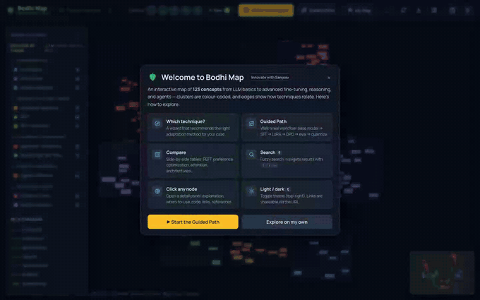
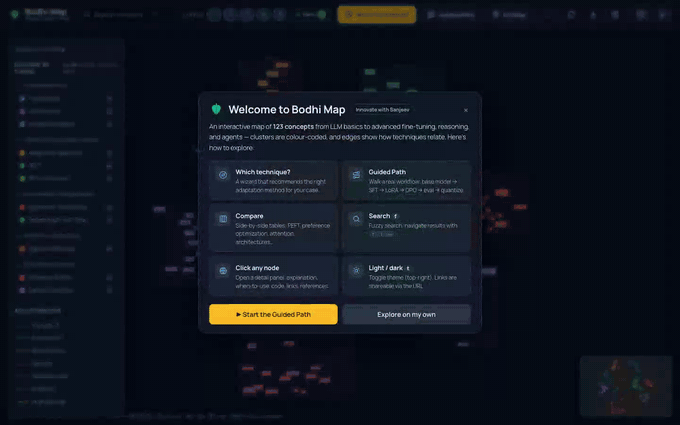
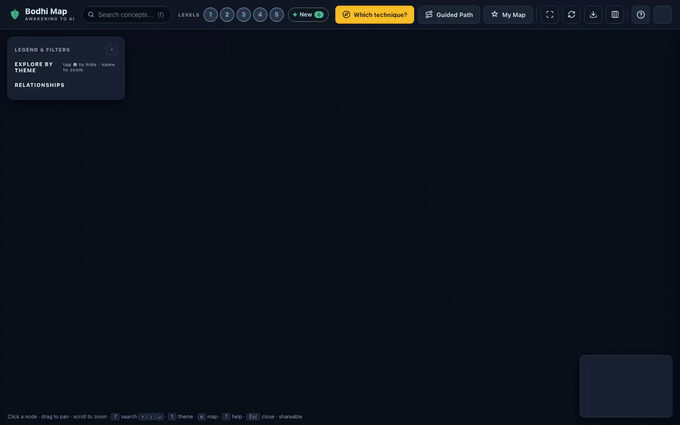
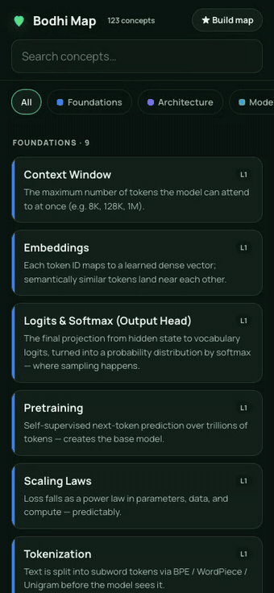

<h1 align="center">Bodhi Map 🍃</h1>

<p align="center"><em>An open, interactive knowledge graph of modern AI — from tokens &amp; attention to LoRA, DPO, reasoning models, and agents.</em></p>

<p align="center">
  <a href="https://ai-first-community.github.io/Bodhi/"></a>
  <a href="https://ai-first-community.github.io/Bodhi/docs/"></a>
  <a href="https://ai-first-community.github.io/Bodhi/"></a>
  <a href="LICENSE"></a>
  <a href="https://github.com/AI-First-Community/Bodhi/stargazers"></a>
</p>

<p align="center">
  <a href="https://ai-first-community.github.io/Bodhi/"></a>
</p>

<p align="center"><a href="https://ai-first-community.github.io/Bodhi/"><b>▶ Try the live app</b></a></p>

> **123 concepts · 11 clusters · fully offline · zero dependencies · MIT-licensed.**

The hard part of learning modern AI isn't finding definitions — it's seeing the **connections** between techniques: what improves on what, what to use when, how it all fits into a pipeline. **Bodhi Map** lays it out as one navigable graph — every technique a node, every relationship a typed edge — so you can see the whole landscape, pick a path, and go deep where you want.

**Who's it for?** Anyone learning or building with modern AI — self-learners and students, engineers ramping into LLMs / fine-tuning / agents, and educators who want a shared map to point people at.

**Find it useful?** [**⭐ Star it**](https://github.com/AI-First-Community/Bodhi) to help others find it, and [**contribute a concept**](https://github.com/AI-First-Community/Bodhi/labels/good%20first%20issue) — adding one is just writing a Markdown file. Created by **Sanjeev** · *Innovate with Sanjeev*.

## See it in action

**🔍 Explore concepts and their connections** — search or click any node to see its typed relationships in the graph, plus a plain-language explainer, code, and sources.

<p align="center"></p>

<details>
<summary><b>▶ More demos</b> — decision wizard · build-your-own-map · compare · guided path · mobile</summary>

<br>

**🧭 Which technique?** — a decision wizard that asks a few questions and recommends the right approach, then opens it in the graph.

<p align="center"></p>

**🗺️ Build your own learning map** — pick the topics you care about; the graph filters to your selection, saved on-device and shareable as a link.

<p align="center"></p>

**⚖️ Compare** — side-by-side matrices for the families you actually have to choose between (PEFT · preference optimization · attention variants · …).

<p align="center"></p>

**▶ Guided Path** — an animated walkthrough of a real workflow: base model → SFT → LoRA → DPO → eval → quantize.

<p align="center"></p>

**📱 Works on mobile too** — a touch-native card view, installable as an app.

<p align="center"></p>

</details>

## Features

- **🕸️ Interactive graph** — 123 concepts across 11 clusters, color-coded, with **typed edges** (`is-a`, `improves-on`, `alternative`, `requires`, `combines`, `builds-on`) on a clean force-directed layout.
- **🔍 Rich detail on every node** — plain-language summary, deeper detail, *when to use*, a code snippet, its connections, and paper references.
- **🧭 Which technique?** — a decision wizard that recommends the right approach (RAG vs prompting vs LoRA/QLoRA vs full fine-tuning vs DPO/RLVR).
- **▶ Guided Path** — an animated walkthrough of a real workflow (base model → SFT → LoRA → DPO → eval → quantize).
- **⚖️ Compare** — side-by-side matrices for PEFT methods, preference optimization, attention variants, and more.
- **🗺️ Build your own learning map** — pick your topics → a personalized, saved, shareable view.
- **⬇️ For agents** — one-click export of the whole knowledge base as a single **LLM-ready** markdown file for RAG/agents.
- **⚡ Fast to use** — fuzzy search (`f`), level & cluster filters, a ✦ "what's new" highlight, light/dark themes, and shareable deep links (`#concept=lora`).
- **📱 Offline & installable** — zero dependencies, works over `file://`, installable as a PWA on desktop or mobile.

### Coverage

Foundations & architecture (tokens → attention → MoE) · the full adaptation ladder · all major PEFT methods · SFT & instruction tuning · preference alignment (RLHF/PPO, DPO, IPO, KTO, ORPO, SimPO, GRPO, RLVR, RLAIF) · efficiency (quantization, GPTQ/AWQ, distillation, FSDP/ZeRO, FlashAttention, speculative decoding, model merging) · reasoning, agents, data & evaluation.

## Why "Bodhi"? — motivation & philosophy

**Bodhi** (बोधि) is a Sanskrit/Pali word for *awakening* — the moment scattered
facts suddenly resolve into understanding. The 🍃 is a nod to the Bodhi tree, under
which that insight is said to have dawned. The name is the goal: not to pile up
information, but to help understanding *click*.

The motivation is simple. Modern AI moves faster than anyone can read, and the
knowledge that matters is real but **scattered** across hundreds of papers, blog
posts, and docs. The hardest part isn't finding definitions — it's seeing the
**connections**: how LoRA relates to full fine-tuning, when DPO beats PPO, where
quantization fits in a pipeline. Newcomers drown in tabs; practitioners keep a
messy map in their heads. Bodhi Map is an attempt to draw that map in the open.

A few principles guide it:

- **Understanding over hype** — every concept earns its place with a real source
  and a plain-language *why* and *when to use*, not buzzwords.
- **Connections are the content** — techniques are nodes; the typed edges
  (`improves-on`, `alternative`, `combines`) are where the real insight lives.
- **Open & offline by default** — no accounts, no CDNs, no telemetry. One folder,
  open `index.html`, and it works on a plane.
- **A path, not a pile** — clustered from foundations to the frontier so you can
  walk from tokens to agents at your own pace.

## Get it

**Use it now — nothing to install:** just open the **[live app ↗](https://ai-first-community.github.io/Bodhi/)**.

**Install it as an app (PWA)** — works offline, launches full-screen, adds to your home screen / dock:

- **Desktop:** open the live site → click the install icon in the address bar.
- **Mobile:** open the site → *Add to Home Screen* (iOS) or the *Install app* prompt (Android) — or scan:

  

**Run locally:** clone the repo and open `index.html` (landing → *Enter the map*) or `app.html` directly — no server, no build step.

## Built on the Open Knowledge Format (OKF)

The content is stored as a conformant [**Open Knowledge Format**](https://github.com/GoogleCloudPlatform/knowledge-catalog/tree/main/okf) v0.1 bundle (Google Cloud, Apache 2.0) under [`knowledge/`](knowledge/) — a directory of markdown files, one per concept, with YAML frontmatter and bundle-relative `.md` links forming the knowledge graph. This makes the content **portable, git-shippable, and agent-ready**: the same bundle that powers this visualizer can be fed to an LLM/RAG pipeline or rendered by any other OKF tool.

`knowledge/` is the **source of truth**. The browser's `js/data.js` is a *generated* artifact — a tiny build compiles the bundle into it so the app stays single-folder and works offline (browsers can't `fetch()` local markdown over `file://`).

```
knowledge/                 ← OKF bundle (SOURCE OF TRUTH)
  index.md                 ← bundle root (reserved, no frontmatter)
  peft/
    index.md               ← cluster listing (reserved)
    lora.md                ← one concept = one markdown file
    ...
okf.config.js              ← controlled vocab (clusters, relations, levels) + flows (wizard, path)
scripts/okf.js             ← export (data.js→bundle) + build (bundle→data.js)
js/data.js                 ← GENERATED — do not edit by hand
```

### Editing / extending

Add or edit a concept by writing a markdown file in the right cluster folder, then rebuild:

```bash
# knowledge/peft/my-technique.md
---
type: PEFT Method
title: My Technique
description: One-line essence (the node summary).
cluster: peft
level: 4
when_to_use: When to reach for it.
relations:
  - improves-on:lora        # creates a typed edge in the graph
references:
  - My Paper|https://arxiv.org/abs/...
---

# My Technique

Deeper explanation (becomes the detail panel body).

## Example
```python
example()
```
```

```bash
npm run build          # or: node scripts/okf.js build   → regenerates js/data.js
npm start              # or: open index.html
```

New clusters / relation types / wizard steps live in `okf.config.js`. The bundle remains valid OKF, so `knowledge/` also opens in Google's reference OKF visualizer.

## Files

| File | Purpose |
|------|---------|
| `index.html` | Landing page — the site front door |
| `app.html` | The interactive map — app shell + UI |
| `css/style.css` | Light/dark themes, typography, panel & graph layout |
| `fonts/` | Manrope (woff2, 400–800) — vendored locally, no font CDN |
| `knowledge/` | **OKF bundle — the source of truth** (concepts + typed relations) |
| `okf.config.js` | Controlled vocabulary + interactive flows |
| `scripts/okf.js` | OKF export / build tooling (zero dependencies) |
| `js/data.js` | **Generated** runtime data (do not hand-edit) |
| `js/graph.js` | Cytoscape rendering & interactions |
| `js/cytoscape.min.js` + `fcose` deps | Vendored graph libraries (offline) |

## Documentation

Full docs live in [**`docs/`**](docs/) — a complete guide to using, authoring, and
extending Bodhi Map:

- [Getting Started](docs/Getting-Started.md) · [User Guide](docs/User-Guide.md) · [FAQ](docs/FAQ.md)
- [Concept Authoring](docs/Concept-Authoring.md) · [Configuration Reference](docs/Configuration-Reference.md) · [Architecture](docs/Architecture.md)
- [Contributing](docs/Contributing.md) · [Release Process](docs/Release-Process.md) · [Roadmap](docs/Roadmap.md) · [Changelog](docs/Changelog.md)

## Contributing

Contributions — new concepts, corrections, better explanations — are welcome, and the project is set up to be **self-serve**:

- 🌱 **Pick up an issue** — start with a [**good first issue**](https://github.com/AI-First-Community/Bodhi/labels/good%20first%20issue) or a [`help wanted`](https://github.com/AI-First-Community/Bodhi/labels/help%20wanted) task; comment to claim it.
- 💡 **Suggest a concept or report an error** — via an [issue template](https://github.com/AI-First-Community/Bodhi/issues/new/choose).
- 💬 **Ask or discuss** in [Discussions](https://github.com/AI-First-Community/Bodhi/discussions).
- 🗺️ See the [BACKLOG](BACKLOG.md) for the roadmap.

Adding a concept is just writing a Markdown file in [`knowledge/`](knowledge/) and running `npm run build` (which validates). See [CONTRIBUTING.md](CONTRIBUTING.md) and the [Concept Authoring](docs/Concept-Authoring.md) guide for the format and quality bar — the only hard rules: **cite a real source, keep it accurate, and stay offline.**

## Credits & sources

Bodhi Map stands on **publicly published research** — it does not originate the
techniques it describes, and credit for the underlying ideas belongs to the
respective authors and research teams. Every concept is grounded in its primary
source: the original paper, official blog post, or documentation. Those citations
live with the content, not buried in a footnote — each concept node shows its
**References** in the detail panel, and the same links are in the OKF frontmatter
under `knowledge/` (200+ source links in total).

What Bodhi Map adds on top is its own contribution: the **curation, hands-on
experience, and practical judgment** — how the pieces fit together, plain-language
explanations, *when to use* guidance, the typed relationships between techniques,
and the interactive experience (decision wizard, guided path, comparisons). The
value is in the synthesis and the experience of navigating it, not in any single
paper.

If you spot a missing, wrong, or better source for any concept, please open an
issue or PR — accurate attribution is part of the [quality bar](CONTRIBUTING.md#quality-bar).

**Third-party software & assets** (all vendored locally so the app stays offline):

| Component | Used for | License |
|-----------|----------|---------|
| [Open Knowledge Format](https://github.com/GoogleCloudPlatform/knowledge-catalog/tree/main/okf) (Google Cloud) | Knowledge bundle format | Apache-2.0 |
| [Cytoscape.js](https://js.cytoscape.org/) + [fcose](https://github.com/iVis-at-Bilkent/cytoscape.js-fcose) layout | Graph rendering & layout | MIT |
| [Manrope](https://github.com/sharanda/manrope) | UI typeface (`fonts/`) | SIL OFL 1.1 |

## Star history

If Bodhi Map is useful to you, a ⭐ helps others discover it — thank you!

<a href="https://star-history.com/#AI-First-Community/Bodhi&Date"></a>

## License

[MIT](LICENSE) © 2026 Sanjeev Azad — *Innovate with Sanjeev*. Use, fork, and build on it freely.

The MIT license covers this project's own code and the curation/explanations. The
referenced papers and sources remain the property of their respective authors.
